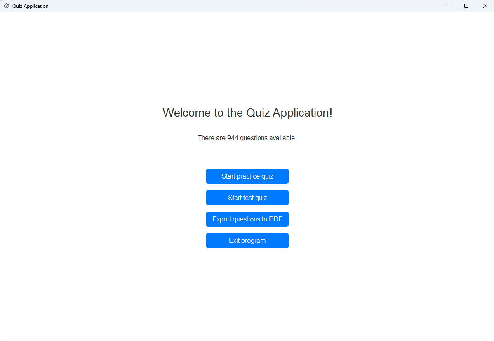

# User guide
This is the user manual for the quiz application. To start the application, run the `main.exe` file.



## Answering the quiz
To run the quiz, start the program and select to *Start practice quiz* or *Start test quiz*. Upon answering all
questions or quitting early, the questions will be corrected and answers to incorrectly answered questions will be
provided. When running in *practice mode*, correct answers will be provided after completing each question. In
*test mode* answers will only be provided after completing the quiz.

## Exporting questions to PDF
All questions stored in the folder `questions` can be exported to a PDF file. When starting the application, select the
option to *Export questions to PDF*. The resulting PDF file is stored in the application root folder.

## Modifying quiz settings
The settings for the quiz can be modified in the file `config/config.json`.
Below are all options included with values explained after the `#` on the line.
```
{
	"shuffle_questions": true, # true OR false
	"test_quiz": {
		"length_minutes": 120, # a positive integer
		"number_questions": 120 # a positive integer
	},
	"export_pdf": {
		"include_answer_directly_after_question": false # true OR false
	}
}
```
If the configuration file cannot be read or is ill formatted, then default values will be used instead.
Note! The application has to be restarted for changes to the configuration file to take effect.

## Adding additional questions
Questions are stored in a folder `questions` in JSON (.json) format. Additional questions can be added to the app by modifying existing JSON files
or creating new ones. All JSON files in the `questions` folder will be read and included by the quiz application.
It is important that all questions follow a specific expected format. Already provided questions can be used as an example for creating new ones.
```
[
    {
        "question": "What is the capital of France?",
        "options": {
            "a": "Berlin",
            "b": "Madrid",
            "c": "Paris"
        },
        "answer": "c",
        "rationale": "The 'rationale' section is optional."
    },
    {
        "question": "Which planet is known as the Red Planet?",
        "options": {
            "a": "Earth",
            "b": "Mars",
            "c": "Jupiter",
            "d": "Saturn"
        },
        "answer": "b"
    }
]
```
The data must be stored in a JSON file, with file extension `.json`. A question must have options labeled with the first
letters of the alphabet. Up to five options can be provided, i.e. letters `a, b, c, d, e`, but not all must be provided,
only three options `a, b, c` must be provided, `d, e` are optional. The `rationale` element in a question is optional.
When loading questions, the files are verified for correctness, if the files have not been written correctly, the application
will indicate which file is faulty and exit the application. To proceed, either fix the faulty file or remove it.
The application has to be restarted for this to take effect.

## Temporarily inactivate questions
To temporarily exclude a file from being part of the quiz, give the filename the postfix `_excluded`, i.e. the file
shall end with `_excluded.json`. E.g. `my_quiz_questions_excluded.json` would not be included in the quiz.
The application has to be restarted for this to take effect.

## Modifying the style sheet
*This feature is intended for advanced users.*
The styling of the app is based on Qt's QSS (similar to CSS for web pages). When starting, the program loads the style
specified in the file `styles/styles.qss`. By modifying that file, the appearance of the program can change without
having to rebuild the application. Some properties might be explicitly overriden by the program code and can therefore
not be set in the style guide.
The application has to be restarted for this to take effect.

## Issues and improvements
Report to Daniel Wrang, daniel.wrang@gmail.com, please be as specific as possible.
